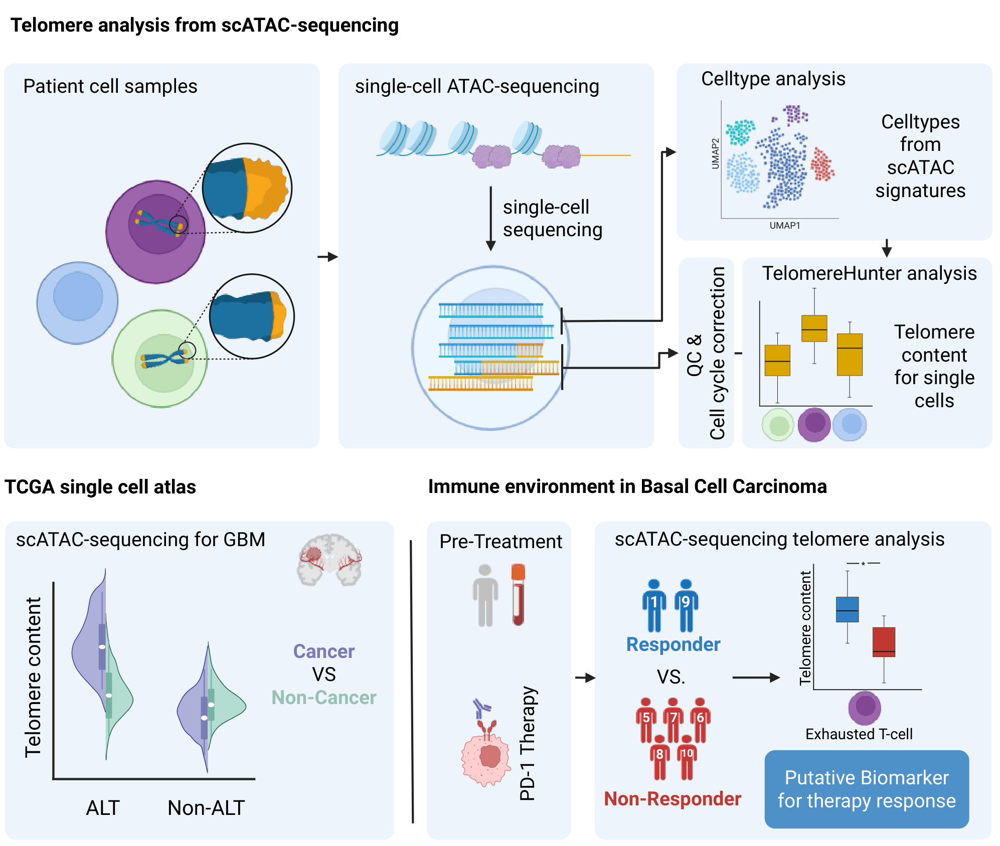

# Profiling telomere content and composition at single-cell resolution in cancer and immune cells

  

**Profiling telomere content and composition at single-cell resolution in cancer and immune cells**  
*Engel et al., 2026*

*This repository contains the R scripts used in our study to reproduce the figures presented in the manuscript, based on telomere analysis of data from Satpathy et al. and Sundaram et al.*
